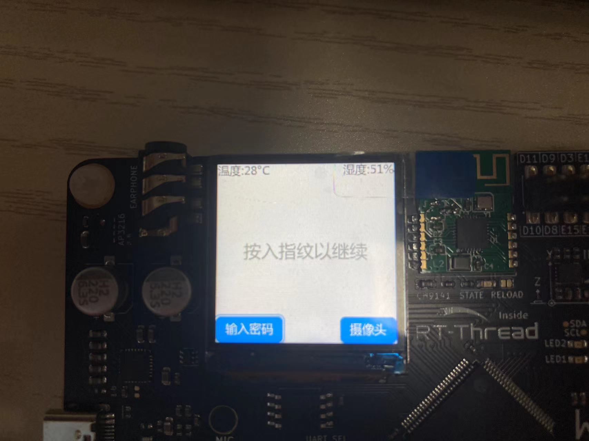
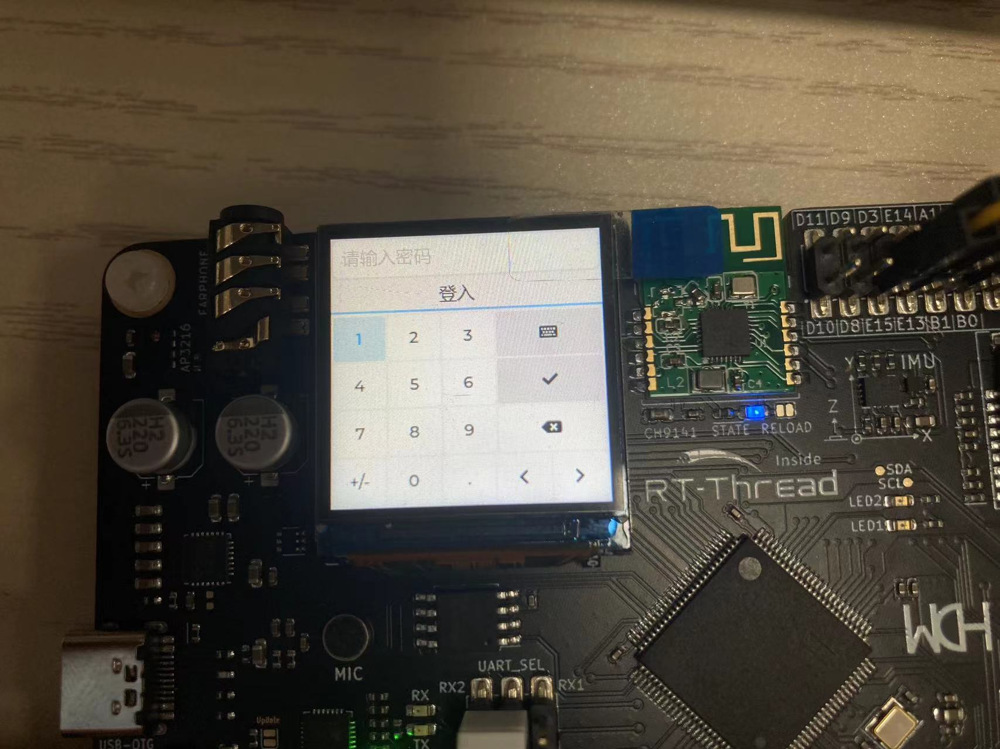
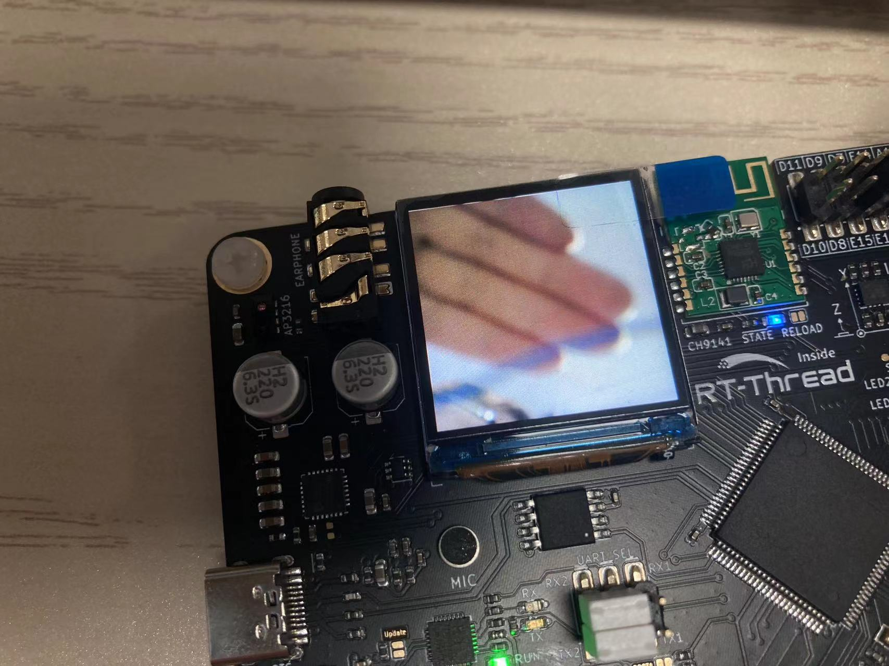
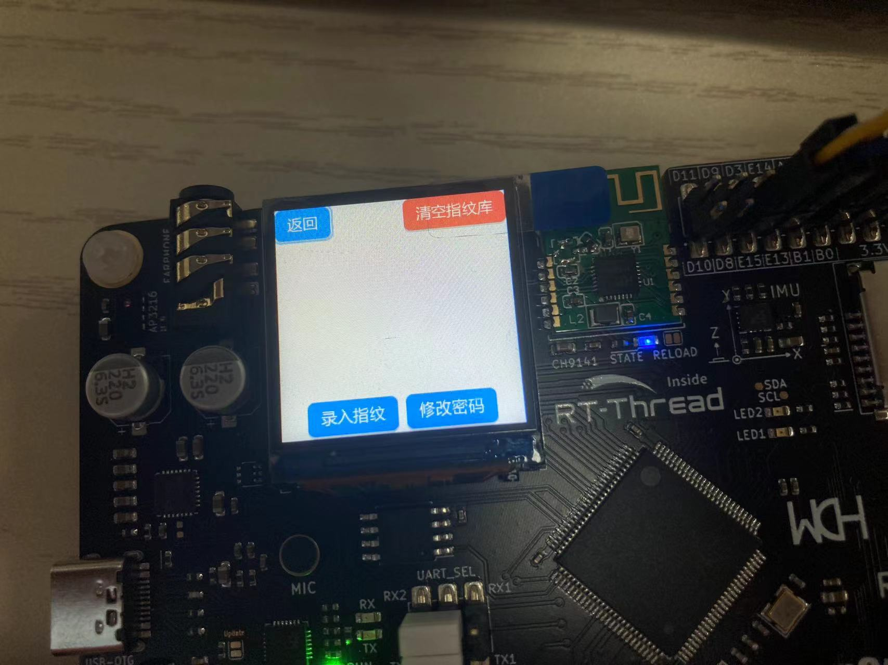

# 这是一个基于CH32V307的智障门锁项目
#### 已经具有基本功能，以FreeRTOS+LVGL的方式实现

+ 密码解锁√
+ 指纹解锁√
+ 温湿度检测√
+ 10秒自动休眠√
+ 按键或隔空唤醒√
+ 30秒自动退出管理员界面√
+ 摄像头显示√

-------------
整体
  

开机界面

主界面
  
输入密码界面
  
摄像头界面
  
登入后的管理员界面
  

